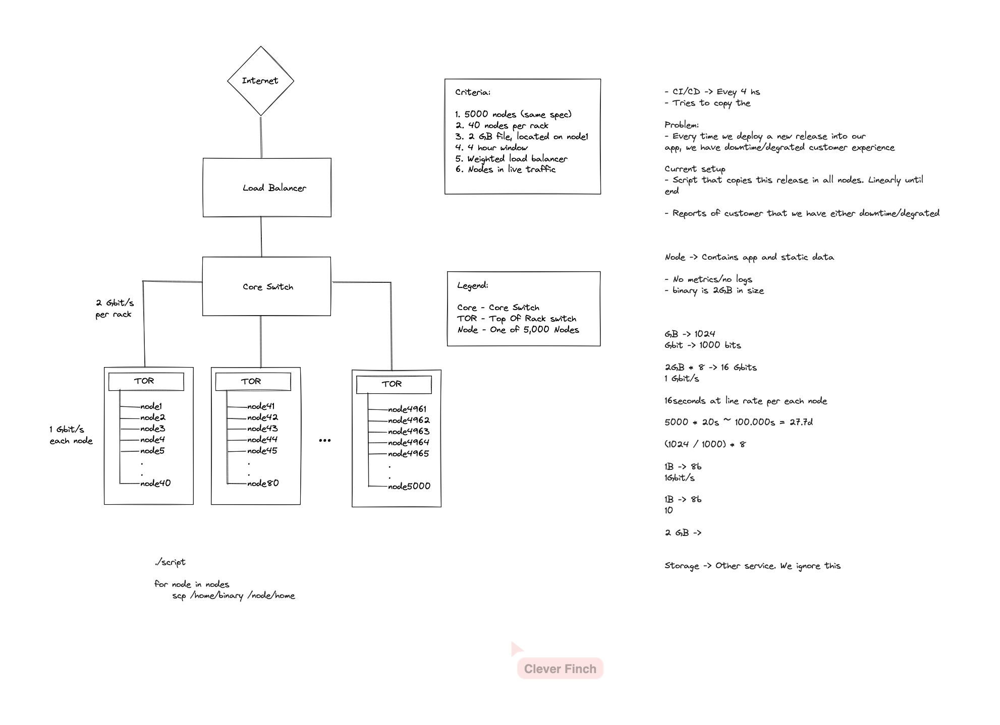

# Intro

This is what I was taken for the production engineer positions at meta. The process
started around March (first call with the interview) and got extended until 30/05/2025.

## How does the process works

These were the steps on my case:

1. HR call to check you are aligned with the position. If yes, jump into pre-screening phase
2. *Pre screening phase:* Consists of 2 interviews, 1 coding and 1 system troubleshooting
3. *HR check:* Assigned a new recruiter that explains what's coming next, which is the on-site 
interviews
4. *On-site:* This round consists of thef following interviews:
	1. Coding: Same as before
	2. System troubleshooting: More in specific
	3. Behavioral: Talk with a manager
	4. System design: This was the tricky one


Let's get into more detail in each of the technical ones:

## Pre-screening

### Coding

You have 2 questions that need to be solved in around 40m. These were the questions on my case:

1. You are given a function f that returns a list of (story, score), you need to implement
 the function top5stories(cutoff: int) which returns a list in descending order of first 5
stories where score is >= cutoff.

Note: function f doesn't necesarily return all what you need from the first time you call it.
Meaning, you might need to call f several times until you get the top 5 stories

Note 2: If f return a story already seen, the score of the story is the sum of all values seen

2. Given 2 csv files about dinosoaurs which had something like

```
name, leg_length, type
name, something about length, another value
```

Read them, calculate the speed which is a function that depends on all values and return the
top 10 dinosaurs that run the fastest according to speed

Seen the above exercise before, the idea is to see if you know how to read files, you consider
border cases, you think if the file doesn't fit in memory, bla bla

*Important in the above exercise:* Remember to consider (and mention!) the case when the file
doesn't fit in memory


### System Troubleshooting

“You have a colleague that tells you that is trying to deploy a new version of
the app you own w/your team and it’s not working. All your team is in a
conference and cannot help you out. What do you do?“

*Idea* Start asking questions and playing around with the commands you know until 
you find out what's the problem :)

On my particular case, you had to ssh the instance, then ps auxww, that would return
an output where the process running had some logs. You cat the logs and eventually 
find out the problem, which was related to some if condition saying "if version to 
deploy > current_version: do_nothing()"


## Onsite

### System Troubleshooting

Explain what ls -l foo* does :). You need to get as detailed as possible! And when I mention this, 
the least expected is to talk about fork, execv, and so on. If you have coded this in C, the better.

### Coding

2 exercises again:

1. Implement isanagram(mystr:str) -> bool. Small variation: mystr could contains characters that were
not ascii, such as !, ? or even space. You should just avoid them

2. Implement mineswiper(rows: int, cols: int, num_mines: int) which should return a list of the positions
of the mine. 

*Note* You can't use functions from the random library except you can explain them :)

### Behavioral

This was a manager asking questions related to your experience. They were the type of:

- Tell me a time when ...
- When did you have a conflict, what did you do? 
- Did you have to work w/conflictive people?

### System Design

This in my case was tricky, because it was not the usual system design interview you would expect, such as
"design whatsapp" or "design instagram". In this interview, you were presented this architecture:



And they problem was: Let's assume we are in a startup, we have the above architecture, and we are trying
to do continuos integration, continuos deployment. We are trying to release a new version, and we are told
that customers are having experience downgrade or even downtimes while doing so. Could you fix the problem?


#### Solution

One possible solution to the exercise about is to use bittorrent as this twitter guy explained almost 15 years ago :) https://vimeo.com/11280885?signup=true
